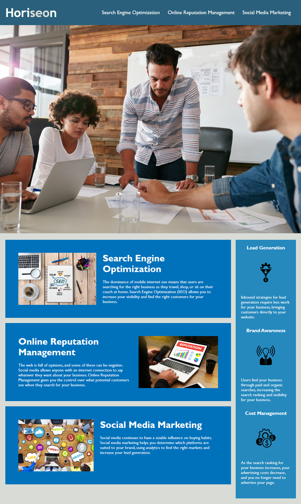

First Readdme_
# Horiseon Site Code Refraction
​
**Quick Look**


## Description
​
Website for **Horiseon** is used to give potential customers insite as to how the company can use its search engine optimization, online reputation management, and social media marketing to increase the customers revenue.
​
## Where were at, Where we need to be
As of right now this site is only a quick,informative page. We still should add a Call to Action and Contact page/info.
​
### Dependencies
​
* Windows 10
* HTML
* CSS

### Compatibility
* Chrome
* Firefox
* MS Edge
​
### Work with Us
​
* Git Clone if you wish to collaborate 
```
git clone https://github.com/AdamR-Work/HoriseonSEO.git
```
​
### Site location
​
* https://adamr-work.github.io/Horiseon/


​
## Help
​
If you have any questions or concerns contact me at adamrfiles@gmail.com
​
## Authors
​
### Main Repository ###

​Starting Code
 **Xandromus**
 [GitHub](https://github.com/coding-boot-camp/urban-octo-telegram)
​
## Version History
​
* 0.2
    * Cleaned up Html and Style Sheets. Add some accessiblity to pictures.
    * [62cc383](https://github.com/AdamR-Work/HoriseonSEO/commit/62cc383648b3a7a515169ffc9adce49ffd830d73)
* 0.1
    * Initial Release
    * See [Commits history](https://github.com/AdamR-Work/HoriseonSEO/commits/master)
​
## License
​
This project is licensed under the AdamR-Work License 
​
